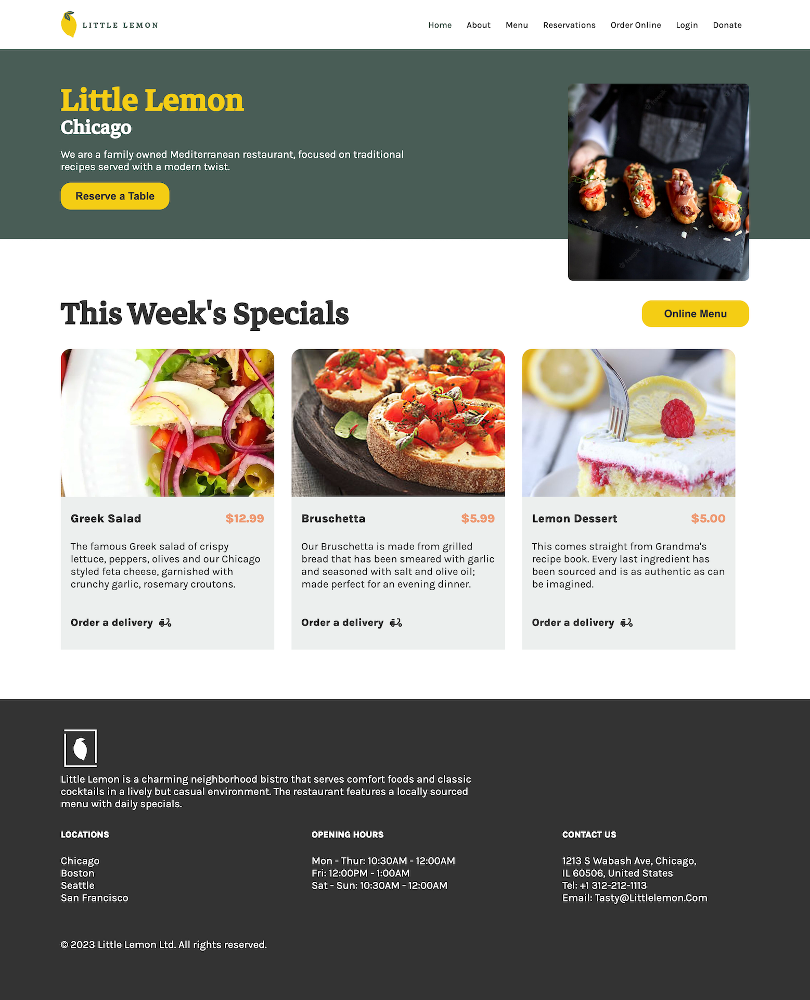
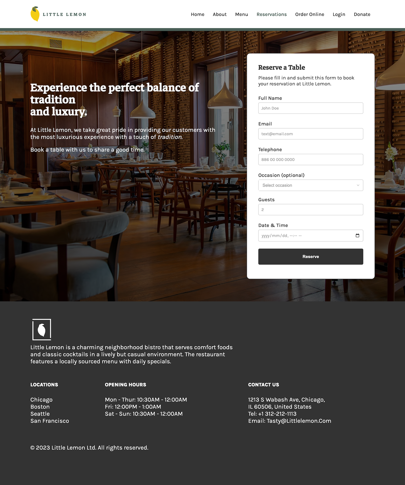

# React project in JavaScript for fictitious restaurant called 'The Little Lemon' (w/ reserve-a-table feature)

### Steps for viewing the project:
1. **Clone repo**

2. **Run 'npm install' in the terminal (under the appropriate directory)**

3. **Run 'npm start'**

and...Voila! Enjoy your meal!

